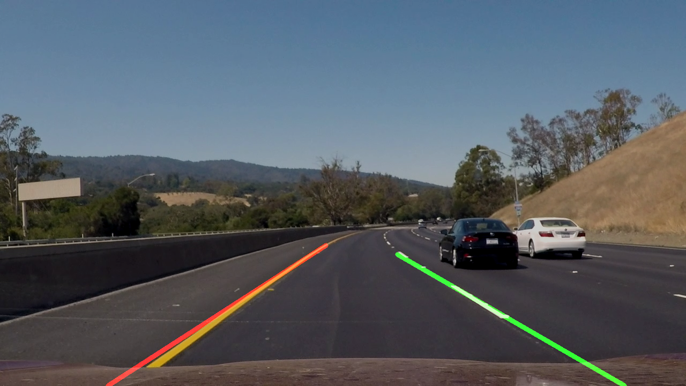

# **Finding Lane Lines on the Road by Manuel Quinteiro** 

**Finding Lane Lines on the Road**

The goals / steps of this project are the following:
* Make a pipeline that finds lane lines on the road
* Reflect on your work in a written report

[//]: # (Image References)

[image1]: ./examples/grayscale.jpg "Grayscale"

---

### Reflection

### 1. Pipeline.

For the first review I have changed all the code, so the process become to:

I've modified the proposed pipeline to:

1) Blur the images with a kernel of 3 pixels size
2) Transform to HSV and make two mask one for yellow and another for white.
3) Join both mask with bytewise or.
4) apply the mask to a filtered images with an and
5) apply Canny edge detection algorithm to the reduced image
6) Apply hought_lines to canny output and display

For the drawing line I have change almost everything and now the process is:

1) Discard lines with low slope
2) Separate in two groups (left and right) the lines depending of the cutting point with the last horizontal line.
3) Join all lines with a kind of mean and using the high point and the lower point to do the representation line.
4) if no line is found I use the most recent one, but only for a maximum number of frames.

Filtering the images in HSV space makes a much better lines definition doing a great job even in the challenge 

If you'd like to include images of the videos and static ones to show how the pipeline works, 

With a debug variable turn to 1 the window chage to multi image windows with a lot of parameter that can be used to tune the system.

More screen shoots are available at test_images_output

For debugin proposes I have added a debug variable that change the interface in order to tune some parameters. 

The application respond to de keyboard:

q -> quit
p -> pause video
s -> screenshot
c -> continue

### 2. Potential shortcomings with the pipeline

The way of select left and right lines is not enought good. It can fail in curves,
The way that I join all the lines to represent only could be better. An small and wrong line could modify a lot te final slope.
Also I'm not happy doing ROI in real enviroment that area could change, for example with a 

### 3. Possible improvements

Doing selection of lines in horizontal zones could improbe the result and work better with curves.
